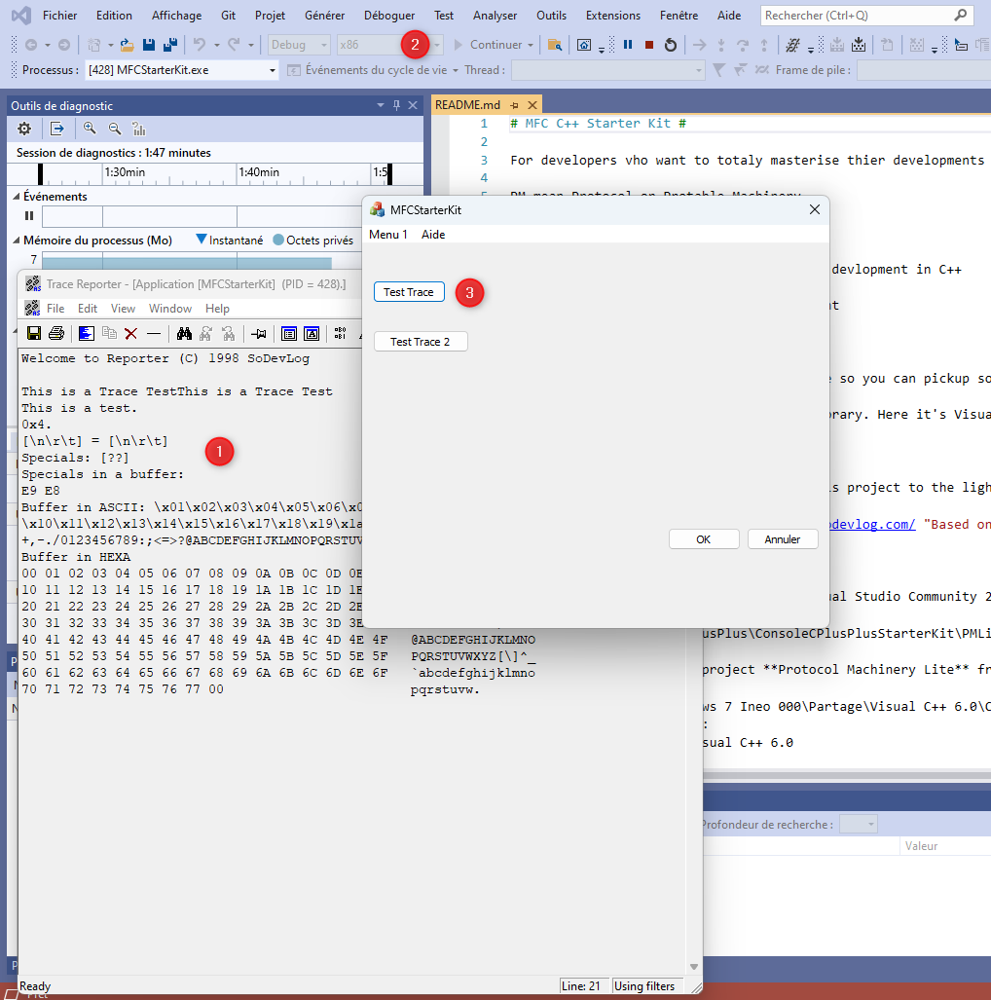

# MFC C++ Starter Kit #

For developers vho want to totally masterise thier developments in C++.

PM means Protable Machinery, some C source codes to masterise your environment.

# Features #

- Masterise your code for multi-plateform devlopment in C++
- MFC Application under tests that send TRACE to Reporter
- Powerfull functions for memory management
 
# Requirements #

- Visual Studio Community
- MFC

## Want to know more

There is a long time a wanted to bring this project to the light. A wanted to make it for Visual Studio Community to develop in C++. This is it.

[Trace Reporter](https://trace-reporter.sodevlog.com/ "Based on TraceReporter")

## Only Console Needed ##

You only need a Console you have this project :

* [Console-CPlusPlus-StarterKit](https://github.com/mabyre/Console-CPlusPlus-StarterKit)

## Getting Started ##

- Clone the repo
- Open the solution: MFC-CPlusPlus-StarterKit\MFCStarterKit/MFCStarterKit.sln 
- Verify compilation and generation
- Before you run, execute: MFC-CPlusPlus-StarterKit/TraceReporter/Reporter.exe to see traces

You can obtain this:

1. You run the Reporter application
2. You run your MFC under test application
3. You click the button to send Traces to the Reporter

If you need sources from the Reporter.EXE or the ASTrace.DLL go for it you will find it here.

